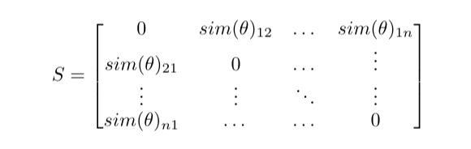
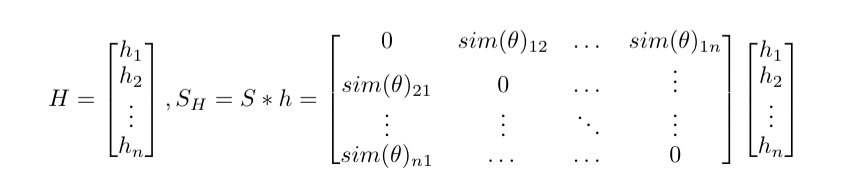
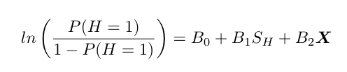

# HiringNLP

Greatings Reader! This repo is an extension of Sarah K. Stein's work. Here, instead of using TFIDF we try a variety of different NLP approaches to measure Linguistic Similarity

## Apporach to measure Linguistic Similarity

To measure Linguistic (Semantic) Similarity between applicants, we tried
several methods of modeling response similarities. Below is the
general procedure:

<span>**1.**</span> Construct pairwise similarities between all
applicant responses (based on some similarity function \(sim\)).
Resulting in a matrix as such:



<span>**2.**</span> Construct an independent pre-hire fit measure,
\(S_H\), by multiplying the similarity matrix, \(S\), by a vector of
binary hiring outcomes, \(H= [0,1]\). This resulted in a variable
measuring the degree to which each individual’s language was similar to
the language used by the group of hired individuals (excluding himself
or herself when appropriate).



For each method of modeling response similarity we have different
procedures:

#### TF-IDF

For each applicant response a Term Frequency vector was made and then
cosine similarities (\(sim = cos\)) were computed between all applicant
responses. This will be our baseline against which to compare all latter
embedding models.

#### Word2Vec Centroid

Either all essay responses or firm emails were used as the training
corpus to create CBOW Word2Vec embeddings. Then for each response, we
found the average word embedding by iterating over all words in the
response to find centroid. Then cosine similarities (\(sim = cos\)) were
computed between all applicant average responses.

#### Word2Vec Word Mover Distance

Either all essay responses or firm emails were used as the training
corpus to create CBOW Word2Vec embeddings. Then for each response we
used Word Mover distances between applicant responses to model sentence
similarity (\(sim = WMD\)).

#### Universal Sentence Encoder

Pre-trained fixed length sentence embedding from Google were downloaded
and retrieved for each applicant response. Then cosine similarities
(\(sim = cos\)) were computed between all USE sentence encoding of
applicant responses.

#### Sentence BERT

Pre-trained fixed length sentence embedding from Siamese BERT network
were downloaded and retrieved for each applicant response. Then cosine
similarities (\(sim = cos\)) were computed between all SBERT sentence
encoding of applicant responses.

## Generalized Logistic Regression

We ran a generalized logistic regression with the dependent variable of hiring outcome based on \(S_H\ and other controls **X**.



## Data
Go to
```
user@yen.stanford.edu:~/ifs/gsb/amirgo/data/hiring
```
Where you must have files:
* `jobvite_1_2_merged_anonymized.RData` which is an R dataframe containing the anonymized demographic data about each applicant (ie. their answers for all questions, weather they were hired or not, how they got recruited, and other fun stuff.)
* `allSentencescleaned.txt` which is a text file where each line is a cleaned (or as clean as needed) sentence from the email exchanges between all people within the company (Note that for our own Word2Vec models we built one with the Answers Corpus (ie all answer for applicants) and one with the Email Corpus (ie all emails from all people within the company))

You will also find alot of other files, feel free to explore but I didn't really use them.

## Usage
Here is the general outline of how to assess the significance of each linguistic measure:
- [ ] Construct a linguistic similarity measure and create a file with this measure for each applicant
- [ ] Insert this file into the `buildModel.R` file
- [ ] Load the models, run a Generalized Logistic Regression, and make LaTex table with `modelToTable.R`

#### Construct a linguistic similarity measure
There are 6 different measures we have tried to use to capture linguistic similarity. They are with the following files (each file is run as `python filename`) and produce the following output files for each question.

File Name | Output File
------------ | -------------
AnswerCorpus_Centroid.py | np_q\#\_similarity_score_centroid.txt 
EmailCorpus_Centroid.py | np_q\#\_similarity_score_centroid_Email.txt 
AnswerCorpus_WMD.py | np_q\#\_similarity_score_wmd.txt
EmailCorpus_WMD.py | np_q\#\_similarity_score_Email_wmd.txt
USE_Google.py | np_q\#\_USE_similarity_score.txt
Sent_Bert.py | np_q\#\_SENT_BERT_similarity_score.txt

These output files must be inserted (ie. the path given) to `buildModel.R` file

###### Caveat: Another `keep.txt` file is also made for the first four measures, this is because during Word2Vec construction and the deltetion and pruning of certain words we removed some responses entirely. Thus this "keep.txt" file aligns the original data with the output file's scores.

#### Using `buildModel.R` file
This file builds the model with the original data. To use this, I suggest opening RStudio and then looking for a `Q# Prep` section (held between the `~`'s) depending on which question you are assessing. Run the section to load into memory (note that depending on the file name there are different sections). Then run the corresponding `Q# Models` section. To do so load in the output file path to the `sim_score` variable (see inline comments). This section creates and saves the model in a `mdf#` variable. 

Now we load the model into the `modelToTable.R` file to run a Generalized Logistic Regression, and make LaTex table

###### Caveat: To use the `keep.txt` file for the first four measures in the `Q# Prep` section there is an option to edit the variable `ones_to_keep` where the keep file needs to be loaded.

#### Using `modelToTable.R` file
This file is quite simple (phew). To use this, again in the RStudio, first load the `mdf#`. Then create the appropriate models and then use `stargazer2` package to make LaTex file.

As a genearl note the `R` files are best used in RStudio and run code section by code section by selecting over the desired lines.


